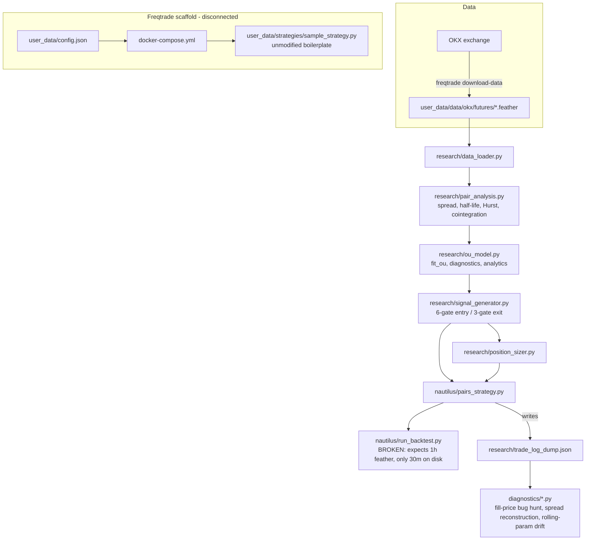

# Pair_Trading Codebase Audit

## 1. Executive Summary

This is a **cryptocurrency statistical-arbitrage (pairs trading) research project**, not a deployed production system. Its core is a from-scratch Ornstein-Uhlenbeck (OU) mean-reversion model applied to log-price spreads between correlated crypto perpetual futures (OKX), with a gated entry/exit signal generator, an OU-based position sizer, and a Nautilus Trader backtesting integration. A parallel `user_data/` directory holds an unmodified Freqtrade scaffold (Docker, config, sample strategy) that is only loosely connected to the actual research — it currently exists mainly as a data-download vehicle.

The research layer (`research/*.py`) is unusually well engineered for a solo quant project: formulas are documented with units and edge cases, and there's a real (if informal) validation suite of print-based "PASS/FAIL" scripts plus three forensic diagnostic scripts that found and confirmed a genuine Nautilus Trader 1.228.0 order-routing bug. However, two of the three executable entry points I tested crash immediately (`research/run_all.py`, `nautilus/run_backtest.py`), there is no automated test framework (pytest/unittest) or CI, and `user_data/config.json` contains plaintext live-looking API credentials. The strategy has been backtested on exactly one pair (AVAX/LINK) over one 30-day window with 6 completed trades — self-documented by the author as statistically insufficient, currently net-losing (-8.46 USDT / -0.85%), and structurally reward:risk-negative (~0.32:1) before that sample is even considered.

## 2. Architecture Overview

No git repository is present, so there is no history to audit — this reflects the state of the working directory only.

## 3. Module-by-Module Breakdown

| Module | Responsibility |
|---|---|
| [research/data_loader.py](research/data_loader.py) | Loads all `*_USDT_USDT-{tf}-futures.feather` OKX files into one wide DataFrame of log-prices, indexed by timestamp. |
| [research/get_data.py](research/get_data.py) | Standalone ccxt script to list top-50 USDT perpetuals by volume. Not imported anywhere else — a one-off exploration script. |
| [research/pair_analysis.py](research/pair_analysis.py) | OLS spread/hedge-ratio (`compute_spread`), half-life via AR(1), Hurst exponent, rolling cointegration stability, and the `analyze_top_pairs` cointegration scanner that screens all pairwise combinations of the universe. |
| [research/ou_model.py](research/ou_model.py) | Fits the OU process to the spread (`fit_ou`), residual diagnostics (Jarque-Bera, Ljung-Box, theta t-test), and closed-form analytics (expected spread, std, confidence interval, reversion probability via reflection principle, expected reversion time). Every public function has a docstring specifying exact return semantics and NaN conditions. |
| [research/trade_diagnostics.py](research/trade_diagnostics.py) | `pre_entry_coint_check` (168-bar Engle-Granger gate) and `spread_volatility_regime` (log-ratio of recent vol to fitted sigma) — both consumed by the signal generator. Also two unused-elsewhere helpers (`measure_approach_speeds`, `conditional_half_life`) that appear to be exploratory. |
| [research/signal_generator.py](research/signal_generator.py) | The strategy core: `generate_entry_signal` (6 sequential gates: cointegration, OU-fit validity, minimum deviation, theta significance, volatility regime, reversion probability) and `generate_exit_signal` (time-stop → adverse-move → take-profit, in that order). |
| [research/position_sizer.py](research/position_sizer.py) | `compute_position_size` sizes both legs so a `stop_sigma`-unit adverse move costs exactly `risk_budget_pct` of capital, using `sigma_stationary = sigma / sqrt(2*theta)` as the risk unit. |
| [nautilus/pairs_strategy.py](nautilus/pairs_strategy.py) | Nautilus `Strategy` subclass wiring the research signals into live order flow: dual-bar sync, gated entry, two-leg market orders, fill tracking, and a custom logical-trade recorder (see §4). |
| [nautilus/run_backtest.py](nautilus/run_backtest.py) | Hardcoded single-pair (AVAX/LINK) backtest harness: builds `CryptoPerpetual` instruments, loads feather bars directly (bypassing `data_loader.py`), and runs the Nautilus `BacktestEngine`. |
| [diagnostics/fill_price_diagnostic.py](diagnostics/fill_price_diagnostic.py), [diagnostics/spread_path_diagnostic.py](diagnostics/spread_path_diagnostic.py), [diagnostics/spread_path_rolling_params.py](diagnostics/spread_path_rolling_params.py) | Forensic, read-only, no-side-effect scripts investigating specific hypotheses against the backtest output (see §4 and §7). |
| [research/validate_*.py](research/validate_ou_analytics.py), [research/playground.py](research/playground.py) | The de facto test suite — print-based scripts with hand-computed expected values and PASS/FAIL verdicts. |
| `user_data/` | Freqtrade scaffold: `config.json` (OKX futures, 39-pair whitelist, live-format credentials), `docker-compose.yml`, and an **unmodified** `sample_strategy.py` / `sample_hyperopt_loss.py` — Freqtrade's own example code, not the pairs strategy. |

## 4. Key Flows Traced

**Flow A — Research signal pipeline (interactive/manual):**
`get_price_levels()` ([data_loader.py:8](research/data_loader.py#L8)) → `analyze_top_pairs()` ([pair_analysis.py:74](research/pair_analysis.py#L74)) screens all `C(n,2)` pairs via Engle-Granger cointegration, then computes half-life/Hurst/beta-CV diagnostics on the top-N → `get_tradeable_pairs()` ([pair_analysis.py:63](research/pair_analysis.py#L63)) filters by four thresholds → for a chosen pair, `fit_ou()` ([ou_model.py:48](research/ou_model.py#L48)) → `generate_entry_signal()` ([signal_generator.py:18](research/signal_generator.py#L18)) applies six gates → `compute_position_size()` ([position_sizer.py:8](research/position_sizer.py#L8)) sizes the trade. This flow is exercised entirely by hand-run scripts; there is no orchestrating CLI.

**Flow B — Nautilus backtest (currently broken):**
`run_backtest.py` reads `AVAX_USDT_USDT-1h-futures.feather` directly ([run_backtest.py:24-31](nautilus/run_backtest.py#L24)), builds two `CryptoPerpetual` instruments and a `BacktestEngine`, and drives `PairsStrategy.on_bar()` ([pairs_strategy.py:83](nautilus/pairs_strategy.py#L83)), which calls the same `generate_entry_signal`/`generate_exit_signal`/`compute_position_size` functions from Flow A, submits two-leg market `OrderList`s, and on close appends a logical-trade record (survives Nautilus's per-leg position accounting, which the author identified as unusable for pairs P&L — see [STEP6_SUMMARY.md:19](research/markdowns/STEP6_SUMMARY.md#L19)) to `research/trade_log_dump.json`. **I ran this end-to-end and it crashes on the first line** — see §6, Finding 1.

**Flow C — Post-hoc forensics on the trade log:**
`trade_log_dump.json` (checked into the repo, apparently from a prior successful run before the data layout changed) feeds three diagnostic scripts: `spread_path_diagnostic.py` reconstructs each trade's intra-hold spread path from frozen entry coefficients and checks reconstruction fidelity/adverse-stop consistency/take-profit touches; `spread_path_rolling_params.py` re-fits OU parameters on a rolling window through each hold to test whether parameter drift could serve as an early-exit signal (concludes: inconclusive, n=6, explicitly caveated against overfitting); `fill_price_diagnostic.py` is a synthetic, self-contained bisection test that confirmed a real Nautilus 1.228.0 defect where grouped `OrderList` submission could route a leg's fill through the wrong instrument's matching engine.

**Flow D — Freqtrade/Docker path (effectively disconnected):**
`docker-compose.yml` launches `freqtradeorg/freqtrade:stable` with `--strategy SampleStrategy` against `user_data/config.json`. `SampleStrategy` ([sample_strategy.py](user_data/strategies/sample_strategy.py)) is Freqtrade's own unmodified example (RSI/TEMA/SAR single-asset strategy) — it has no relationship to the OU pairs-trading logic. This path appears to exist solely so `freqtrade download-data` can populate the feather files Flow A/B consume.

## 5. Test Coverage Assessment

**No automated test framework is configured.** `pytest` and `unittest` do not appear anywhere in the codebase, and neither is installed in `.venv`. There is no CI configuration. Coverage tooling was not found, so no coverage percentage can be reported — estimating one would not be honest.

The actual test surface is seven manually-run, print-based scripts in `research/`. I ran all of them directly:

| Script | Result |
|---|---|
| [validate_ou_analytics.py](research/validate_ou_analytics.py) | 6/6 analytical checks PASS; **Monte Carlo verification FAILs its own 5% tolerance** (6.65% observed) — but this is a *known, documented* approximation error of the reflection-principle formula, and `generate_entry_signal`'s default `prob_threshold=0.67` is explicitly calibrated to compensate for it ([signal_generator.py:51-53](research/signal_generator.py#L51)). Not a live bug, but the self-test as written will always report FAIL. |
| [validate_position_sizer.py](research/validate_position_sizer.py) | 9/9 assertions PASS. |
| [validate_exit_signal.py](research/validate_exit_signal.py) | 6/6 PASS. |
| [validate_ou_diagnostics.py](research/validate_ou_diagnostics.py) | Synthetic OU-recovery test PASSes; live AVAX/LINK check is informational only (no PASS/FAIL asserted) and currently shows `theta_p=0.174` — i.e., mean reversion is not statistically significant on the current data snapshot, so gate 3 would reject this pair today. |
| [playground.py](research/playground.py) | 3/3 gate-isolation smoke tests PASS. |
| [validate_signal_generator.py](research/validate_signal_generator.py) | Gate 1 and Gate 5 tests PASS; **the Gate 4 (regime) test FAILs** — but I traced this to a bug in the *test script*, not the product code (see §6, Finding 5). Live signal check correctly returns `None`, consistent with `validate_ou_diagnostics.py`'s finding above. |
| [run_all.py](research/run_all.py) | **Crashes immediately** — `TypeError`, see §6 Finding 2. |

Untested/under-tested paths worth flagging: `nautilus/pairs_strategy.py` (the actual order-submission, fill-tracking, and trade-recording logic) has zero automated coverage — it's only ever been exercised by the one broken `run_backtest.py` entry point and validated retroactively via the `diagnostics/` scripts against a single stale trade log. Single-leg partial fills are explicitly unhandled in that file ([pairs_strategy.py:157-158](nautilus/pairs_strategy.py#L157), [236-237](nautilus/pairs_strategy.py#L236)) and untested. `data_loader.py`, `get_data.py`, and `spread_visualiser.py` have no validation coverage at all.

## 6. Limitations

**1. [Critical] `nautilus/run_backtest.py` cannot run against the data currently on disk.**
It hardcodes paths to `AVAX_USDT_USDT-1h-futures.feather` / `LINK_USDT_USDT-1h-futures.feather` ([run_backtest.py:24-27](nautilus/run_backtest.py#L24)), but `user_data/data/okx/futures/` only contains `30m-futures`, `1h-mark`, and `1h-funding_rate` feathers for every ticker — no `1h-futures` files exist. I ran it and confirmed: `FileNotFoundError` on line 30, first executable statement. This is the project's only backtest entry point, and it is currently dead. Not mitigated elsewhere.

**2. [High] `research/run_all.py` is broken — dead entry point.**
Line 8 calls `analyze_top_pairs(start_date="2026-01-01")`, but `analyze_top_pairs` ([pair_analysis.py:74](research/pair_analysis.py#L74)) takes `(top_n, window, days)` — no `start_date` parameter. I ran it and confirmed `TypeError` on the first line. Even if that were fixed, line 11 references `summary["half_life_days"]`, but the DataFrame `analyze_top_pairs` returns uses the column name `half_life_hours` ([pair_analysis.py:134](research/pair_analysis.py#L134)) — a second, independent break. This script was clearly written against an earlier version of `pair_analysis.py` and never updated.

**3. [High] Plaintext live-format credentials committed in `user_data/config.json`.**
The `api_server` block contains a non-empty `jwt_secret_key`, `ws_token`, `username`, and `password` ([config.json](user_data/config.json), api_server section) bound to `0.0.0.0` on port 8080. Not evaluated for whether these are still live, but they should be rotated and moved to environment variables / a gitignored secrets file regardless — especially since the exchange `key`/`secret` fields sit right next to them, currently empty but in the same unprotected file.

**4. [High, self-documented] Structural reward:risk asymmetry.**
The author's own STEP6_SUMMARY.md ([STEP6_SUMMARY.md:88](research/markdowns/STEP6_SUMMARY.md#L88)) states the take-profit (80% of entry deviation) versus the 2.5-sigma stop produces roughly 0.32:1 reward:risk before commissions — meaning the strategy needs a high win rate just to break even, and the one completed backtest (6 trades, -8.46 USDT net) is consistent with that. Identified but not addressed.

**5. [Medium] `research/validate_signal_generator.py`'s Gate 4 test is internally inconsistent and reports a false failure.**
It injects noise across the *entire* price series ([validate_signal_generator.py:36](research/validate_signal_generator.py#L36)) but compares the resulting regime ratio against `sigma` fitted on the *original, clean* series computed earlier in the script — while `generate_entry_signal` internally re-fits OU on the noisy series, whose sigma absorbs the same noise, so the internally-computed regime ratio is much smaller than the externally-computed `actual_regime` the test asserts against. `playground.py`'s version of the same test ([playground.py:34-53](research/playground.py#L34)), which correctly confines noise injection to the trailing 168 bars, passes cleanly. This isn't a signal_generator.py bug, but it means the "test suite" currently contains a script that will always cry wolf on a gate that is actually working — worth deleting or fixing so it doesn't erode trust in future validation runs.

**6. [Medium] `nautilus/pairs_strategy.py` hardcodes `capital=1000.0`** at the position-sizing call site ([pairs_strategy.py:118](nautilus/pairs_strategy.py#L118)) rather than reading live account equity from `self.portfolio`/`self.cache`. It happens to match the `run_backtest.py` starting balance today, but the two are independent hardcoded values with no shared source of truth — a future change to one starting balance silently desyncs position sizing from actual capital.

**7. [Medium, self-documented] Single-leg partial fills are explicitly unhandled** ([pairs_strategy.py:157-158](nautilus/pairs_strategy.py#L157), [236-237](nautilus/pairs_strategy.py#L236)) — if one leg of a two-leg market order fills and the other is rejected, the strategy has no reconciliation logic. Comment says "deferred to live/paper deployment," i.e., known and accepted for backtest-only use, but blocking for anything beyond that.

**8. [Low] `research/get_data.py`** performs a live network call (`exchange.fetch_tickers()`) with no error handling, retry, or rate-limit awareness, and isn't imported by any other module — a disposable exploration script rather than part of the pipeline.

**9. [Low] `user_data/strategies/sample_strategy.py` and `user_data/hyperopts/sample_hyperopt_loss.py` are unmodified Freqtrade boilerplate** (428 and 57 lines respectively) with no connection to the pairs-trading logic, and `docker-compose.yml` still points at `--strategy SampleStrategy` as its default command — running `docker compose up` as-is would launch an unrelated single-asset RSI strategy, not this project's actual strategy.

**10. [Low] No dependency manifest.** No `requirements.txt`, `pyproject.toml`, or `Pipfile` exists anywhere in the repo; the `.venv` was created ad hoc (`pyvenv.cfg` shows it was originally built from a sibling `freqtrade` checkout: `command = ... -m venv /Users/elvisobondo/freqtrade/.venv`). Reproducing the environment from this repo alone isn't currently possible.

## 7. Successes / Strengths

- **Rigorous, evidence-driven diagnostic methodology.** `diagnostics/fill_price_diagnostic.py` is a genuinely well-designed bisection test: two instruments with disjoint, non-overlapping price ranges, run first with the production `OrderList` submission pattern and then, only if the bug reproduces, with an isolated variable-controlled second run — this is how you actually confirm a third-party framework bug (Nautilus Trader 1.228.0's grouped-`OrderList` cross-instrument fill routing) rather than just suspecting one.
- **Self-aware statistical honesty.** `diagnostics/spread_path_rolling_params.py` repeatedly and explicitly caveats its own findings ("n=6... directional only... insufficient to justify a new exit rule on its own", [spread_path_rolling_params.py:535-536](diagnostics/spread_path_rolling_params.py#L535)) and even names the specific overfitting failure mode it's guarding against (rolling parameters "re-encoding" the price path rather than leading it, [spread_path_rolling_params.py:15-21](diagnostics/spread_path_rolling_params.py#L15)). This is a level of rigor that's easy to skip in solo research code.
- **Formula-level documentation with explicit units and edge cases.** Every function in `ou_model.py` and `signal_generator.py` documents not just what it computes but the exact conditions under which it returns NaN/None and why each default (`prob_threshold=0.67`, `stop_sigma=2.5`, `min_deviation_sigma=1.0`) was chosen empirically — see [signal_generator.py:42-96](research/signal_generator.py#L42) and [STEP6_SUMMARY.md:33-57](research/markdowns/STEP6_SUMMARY.md#L33) for the audit trail showing gates were added/tuned in response to diagnostic findings, not guessed.
- **A real fix for a real Nautilus limitation.** The custom trade recorder in `pairs_strategy.py` ([pairs_strategy.py:246-360](nautilus/pairs_strategy.py#L246)) correctly identifies that Nautilus's built-in win-rate/expectancy stats are meaningless for a two-leg pairs strategy (each round trip = 4 fills = "2 open + 2 closed positions") and builds logical-trade-level accounting instead, with commission netting from real fill prices.
- **Consistent unit discipline across modules.** `sigma_stationary = sigma / sqrt(2*theta)` is used identically as the risk unit in the position sizer, the exit stop, and the regime-classifier gate — a common source of silent bugs in quant code (mixing raw vs. stationary volatility) that this codebase avoids throughout.
- **Analytical formulas cross-checked against Monte Carlo**, not just unit-tested against hand math — `validate_ou_analytics.py` compares the closed-form reversion probability to a 10,000-path simulation, catches a real ~6-7% approximation gap, and that gap is then fed back into gate calibration rather than ignored.

## 8. Recommendations (prioritized)

1. **Fix or remove the two broken entry points.** Either regenerate `1h-futures.feather` data (or point `run_backtest.py` at the 30m data via `data_loader.py` instead of hand-rolled feather reads) to unblock backtesting; delete `run_all.py` or update it to match `pair_analysis.py`'s current signature/columns.
2. **Rotate the credentials in `user_data/config.json`** and move `jwt_secret_key`/`ws_token`/`username`/`password` to environment variables or a gitignored override file before this directory is ever pushed anywhere.
3. **Add a `requirements.txt`/`pyproject.toml`** pinning `nautilus_trader==1.228.0`, `pandas`, `numpy`, `scipy`, `statsmodels`, `ccxt` so the environment is reproducible outside the current ad hoc `.venv`.
4. **Convert the `validate_*.py`/`playground.py` scripts to real pytest tests** (assert-based, not print/PASS-FAIL) so they can run in CI and so the Gate 4 test bug (Finding 5) gets caught by a linter/reviewer instead of silently misleading whoever runs it next.
5. **Address the reward:risk asymmetry** (Finding 4) before running more capital through this — either widen the take-profit fraction, tighten the stop, or explicitly accept a lower win-rate requirement isn't being met.
6. **Either wire `docker-compose.yml`/`user_data/strategies` into the actual pairs strategy or delete the unused Freqtrade scaffold** to remove the risk of someone running `docker compose up` and unknowingly deploying `SampleStrategy`.
7. **Expand beyond the single AVAX/LINK, single-30-day-window backtest** before drawing any conclusions — `analyze_top_pairs`/`get_tradeable_pairs` already exist to find other candidate pairs; multi-pair, multi-period backtesting is the natural next step and is exactly what the small-sample caveats in `spread_path_rolling_params.py` are asking for.
